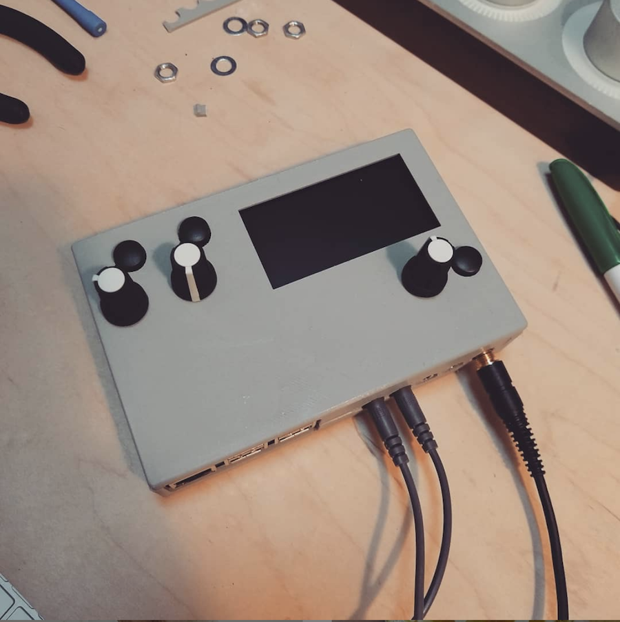

# Fates 3d case

### What this is:

- This is a 3d printed case for "fates" designed in fusion 360
- It has built in standoffs and supports so you don't need to purchase any extra
- The case more or less snaps together

### What is missing:

- No consideration was given to cooling/air flow
- ~~There is no USB-C slot at the back of the case~~
- ~~There no hole for the 4th encoder~~
- (the above two items were added thanks to james everitt)

### Before you print this please know that:

- This is not perfect
- I'd recommend getting it printed by a friend with a 3d printer, or at a local hackerspace instead of spending a lot of money getting it printed using an online service 
- The tolerances are really tight. Once you install your Rpi + fates shield it will be a little difficult to remove. You might need a little spudger/pry tools to remove it

### Licence

- Creative Commons: Attribution-NonCommercial-ShareAlike 4.0 International
- In other words: you cannot sell this, and if you modify the design you cannot sell that either. Otherwise do whatever your heart desires
